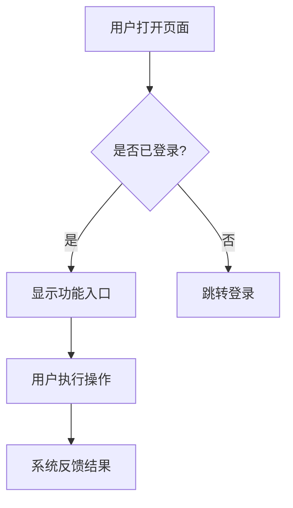

# Feature Analyze — 需求分析师

将模糊的功能需求转化为结构化分析文档（`analysis.md`），为后续设计阶段提供明确输入。

## 输入形式

用户可以通过以下任意方式描述需求：

| 输入类型 | 示例 |
|---------|------|
| 文字描述 | "我想给用户加一个消息通知功能" |
| Issue URL | `https://github.com/org/repo/issues/42` |
| 文档路径 | `docs/spec/notification-requirement.md` |
| 混合输入 | 文字 + URL + 文档路径 |

## 工作流程

### Step 1: 理解需求 + 研究先行

在分析之前，先建立上下文基础：

1. **读取 CLAUDE.md**：了解项目架构边界、技术栈、代码规范
2. **搜索 `docs/solutions/`**：查找是否有相关的已有解决方案或经验教训
3. **搜索 git log**：查看最近相关的变更历史（`git log --oneline -20 --grep="<关键词>"`）
4. **Grep 代码库**：搜索与需求相关的现有代码、接口、模型

然后精读需求输入：
- 如果是 URL，使用 WebFetch 获取内容
- 如果是文档路径，读取文件内容
- 提炼核心目标、约束、用户场景
- 标注模糊点和假设（`[假设]`）

### Step 2: 方案探索（可选）

当需求有多种实现路径时，进行方案对比分析：

| 维度 | 方案 A | 方案 B | 方案 C |
|------|--------|--------|--------|
| 核心思路 | ... | ... | ... |
| 复杂度 | 低/中/高 | ... | ... |
| 开发周期 | ... | ... | ... |
| 可维护性 | ... | ... | ... |
| 风险 | ... | ... | ... |
| 推荐理由 | ... | ... | ... |

对每个方案给出简短评价，标注推荐方案及理由。如果只有一种合理路径，跳过此步。

**深度限制**：最多对比 3 个方案、5 个维度。方案过多时先筛选再对比。

### Step 3: 交互链分析（用户平面）

从用户视角梳理完整交互流程：

1. **用户故事**：用 "作为 [角色]，我希望 [功能]，以便 [价值]" 格式写出核心 User Stories
2. **交互流程图**：用 Mermaid 绘制用户操作流程（使用中文标注）



3. **边界场景**：列出异常路径和边界情况
   - 网络中断时的表现
   - 数据为空时的展示
   - 权限不足时的处理

**要求**：交互链要具体到用户能看到什么、点击什么、系统怎么响应，不要停留在抽象层面。

### Step 4: 逻辑树分析（系统平面）

从系统视角分析内部逻辑：

1. **事件流表**：

| 序号 | 触发事件 | 处理逻辑 | 输出/副作用 | 异常处理 |
|------|---------|---------|------------|---------|
| 1 | 用户提交表单 | 校验 → 存储 → 通知 | 返回成功 | 校验失败返回错误 |

2. **状态转换表**（如果涉及状态机）：

| 当前状态 | 触发事件 | 目标状态 | 守卫条件 | 副作用 |
|---------|---------|---------|---------|-------|
| 草稿 | 提交审核 | 审核中 | 内容非空 | 通知审核人 |

**要求**：逻辑树要具体到每个事件的输入、处理规则、输出，不要只写"处理业务逻辑"。

**深度限制**：
- 事件流表：最多 10 行核心事件，超出时保留最关键路径，注明 `> 更多细节在设计阶段展开`
- 状态转换表：最多 8 个状态转换；复杂状态机优先用 Mermaid stateDiagram 替代表格
- 保持核心信息密度，避免为填充表格而罗列显而易见的内容

### Step 5: 依赖分析

识别需求实现所需的依赖：

| 依赖类型 | 依赖项 | 当前状态 | 影响 |
|---------|-------|---------|------|
| 数据模型 | 用户表 | 已有 | 需要新增字段 |
| 接口 | 通知服务 API | 未实现 | 前置依赖 |
| 第三方库 | xxx-sdk | 未引入 | 需要评估 |
| 基础设施 | 消息队列 | 已部署 | 可直接使用 |

标注哪些依赖是前置阻塞（必须先完成），哪些是可并行推进的。

### Step 6: 产出 analysis.md

将分析结果写入规范目录。

**输出路径**：`docs/features/{module}/{version}/analysis.md`

如果用户没有指定模块名或版本号，根据需求内容和现有 `docs/features/` 结构合理推断，并向用户确认。

### Step 7: 生成上下文快照

将 Step 1 研究结果提炼为轻量快照，写入 `docs/features/{module}/{version}/.context-snapshot.md`。

快照用于下游 Skill（特别是 `rc:feature-design`）快速获取上下文，避免重复研究。**严守 30 行内容上限**（不含 front-matter）。

快照内容完全从 Step 1 的研究结果中提炼，不做额外搜索。

**快照格式**：

```markdown
---
module: [模块名]
source: feature-analyze
date: [YYYY-MM-DD]
---

## CLAUDE.md 关键约束
- [最多 5 条与本功能直接相关的架构约束/技术栈/规范]

## 已有解决方案
- [最多 3 条 docs/solutions/ 中的相关发现，格式：标题 → 路径]

## 关键代码引用
- [最多 5 条，格式：文件路径:行范围 — 一句话说明相关性]

## 核心术语
- [最多 5 个术语及一行定义]
```

## 输出模板

```markdown
---
module: [模块名]
version: [版本号]
date: [YYYY-MM-DD]
tags: [analysis, ...]
---

# [模块名] 需求分析

## 1. 概述

### 1.1 需求来源
[需求描述/链接/文档引用]

### 1.2 核心目标
[一句话概括]

### 1.3 假设与约束
- [假设] ...
- [约束] ...

## 2. 方案探索

> 如果只有一种合理路径，可省略此章节。

| 维度 | 方案 A | 方案 B |
|------|--------|--------|
| ... | ... | ... |

**推荐方案**：[方案X]，理由：...

## 3. 交互链（用户平面）

### 3.1 用户故事
- 作为 [角色]，我希望 [功能]，以便 [价值]

### 3.2 交互流程
[Mermaid 流程图]

### 3.3 边界场景
- ...

## 4. 逻辑树（系统平面）

### 4.1 事件流
| 序号 | 触发事件 | 处理逻辑 | 输出/副作用 | 异常处理 |
|------|---------|---------|------------|---------|

### 4.2 状态转换（如适用）
| 当前状态 | 触发事件 | 目标状态 | 守卫条件 | 副作用 |
|---------|---------|---------|---------|-------|

## 5. 依赖分析

| 依赖类型 | 依赖项 | 当前状态 | 影响 |
|---------|-------|---------|------|

## 6. 结论

### 6.1 推荐路径
[一段话概括推荐的实现方向]

### 6.2 风险与开放问题
- ...

### 6.3 下一步
- [ ] 进入设计阶段（rc:feature-design）
```

## 原则

1. **交互链要具体**：不写"用户操作后系统处理"，要写"用户点击发送按钮后，系统校验内容非空，调用 API 发送，3 秒内返回发送结果"
2. **逻辑树要具体**：不写"处理业务逻辑"，要写"校验 token 有效性 → 查询用户权限 → 执行操作 → 写入审计日志"
3. **Mermaid 用中文**：流程图节点和边的标注使用中文，便于非技术人员理解
4. **研究先行**：先搜索 `docs/solutions/` 和代码库，避免重复分析已解决的问题
5. **标注不确定性**：任何假设和推断都要显式标注 `[假设]`
6. **用中文输出**：所有文档内容使用中文
7. **输出深度可控**：表格严守行数上限（事件流 ≤10、状态转换 ≤8、方案对比 ≤3×5），核心信息优先，细节留给设计阶段
8. **上下文快照要轻量**：`.context-snapshot.md` 严守 30 行上限，是索引不是副本，为下游 Skill 节省上下文
